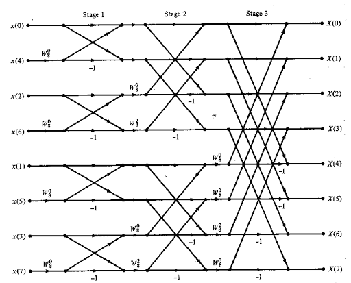
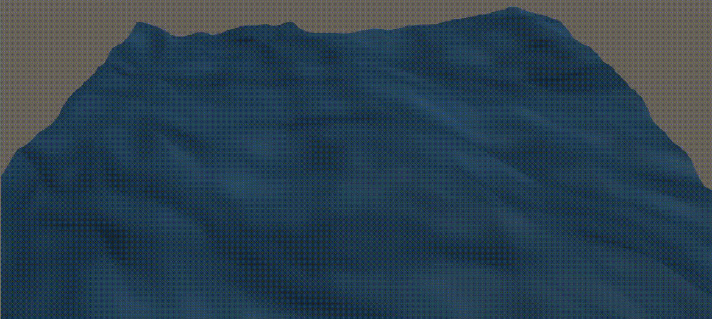
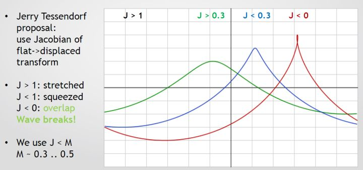
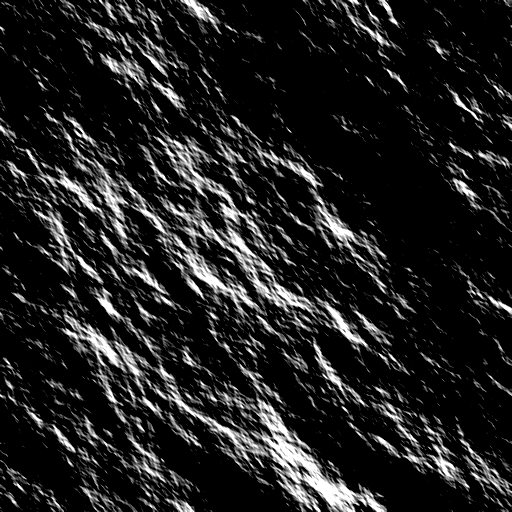
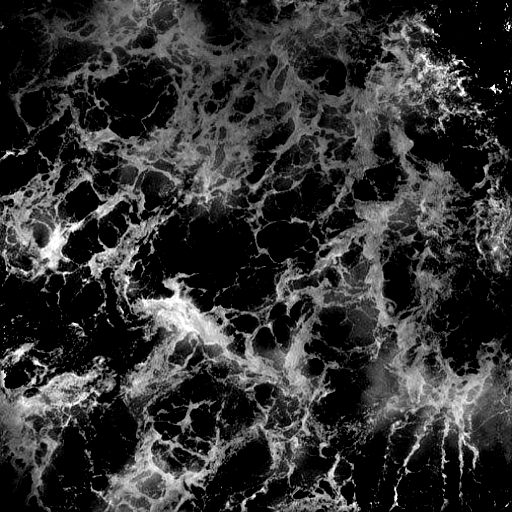

# Realistic Ocean Simulation

**Figure 1:** Simulated water surface with a realistic surface shader in a grid of 256x256 and a total size of 100 meters. 

## Introduction
In this project, I will implement the statistical wave model from the equations in Tessendorf's paper[1] on simulating ocean water. The ocean rendering technique in this article applies heightmap generation by summing a vast number of waves using the Fast Fourier Transform, with user-controllable size and resolution, and which can be tiled seamlessly over a larger domain.
The main principle of Ocean rendering is that it can be modeled very well by thinking of it as a sum of "infinite" waves at different amplitudes traveling in different directions. These waves aren't randomly chosen; they come from using statistical-empirical models of the ocean, based on oceanographic research. In this article, I will show how to recreate and animate the ocean surface and add additional visual features like foam and illumination.

## Waves and the Fourier Transform
This technique consists of writing an inverse Fourier transform on the Fourier domain of the ocean height field to get the space domain representation of this same field, at each time t. For every frame we calculate, for each pair (x,z) in a rectangular grid the y component of this point, which represents the ocean height at that location.
Given the ocean height field function in the spatial frequency domain $$ \tilde h(\pmb{k}, t) $$, to find the original function in the spatial domain, we need to perform the inverse Fourier Transform, that is, evaluate the integral above:

$$
\int_{-\infty}^{\infty}  \tilde h(\pmb{k},t).exp(i\pmb{k.x})d\pmb{k}
$$

To perform this calculation, it's necessary to sample the signal in a discrete interval over a support domain. So the integral becomes a summation, expressed by:

$$
h(\pmb{x}, t) = \sum_{\pmb{k}} \tilde h(\pmb{x},t).exp(i\pmb{k.x})
$$

Where **k** is the wave vector and can be defined as:

$$
\pmb{k} = (k_x, k_z)
\\~\\
k_x = \frac{2\pi n}{L_x}
\\~\\
k_z = \frac{2\pi m}{L_z}
$$

Where:

$$
-\frac{N}{2} \leq  n \leq \frac{N}{2}
\\~\\
-\frac{M}{2} \leq  m \leq \frac{M}{2}
$$

But, for most of our work, we deal with variables i and j in different domains:

$$
0 \leq i <N
\\
0 \leq j <M
$$

So, we can make the transformation:

$$
n = i - \frac{N}{2}
\\~\\
m = j - \frac{M}{2}
$$

The fft process generates the height field at discrete points:

$$
 \pmb{x} = (\frac{nL_x}{N}, \frac{mL_z}{M})
$$

Finally, expressing the summation of 2-D data and using the values of i and j:

$$
h(x,z, t) =\sum_{i = 0}^{N-1} \sum_{j = 0}^{M-1} \tilde h(i - \frac{N}{2},j - \frac{M}{2},t)exp(\frac{ix\pi(2i-N)}{L_x}+(\frac{iz\pi(2j-N)}{L_z})
$$

## The FFT
To compute the Fourier Transform, we need to calculate the summation in the previous section; this requires a complexity of O(n²) for a 1-D Fourier Transform, which is terrible, especially when we need to perform 2-D operations in a real-time system. The best approach is using the FFT(Fast Fourier Transform) algorithm, which implements the calculation with an O(nlog(n)) complexity for 1-D data. The algorithm is quite complicated, but essentially, for a Radix-2 FFT, it splits recursively into half the data, performing calculations using the cyclic property of the n-th roots of unity, this way, avoiding unnecessary calculations. Above is a simple example of the algorithm for 1-D data with eight elements; the peculiar structure of this graph also gives the name "Butterfly Algorithm" to the FFT.

 

**Figure 2:** Butterfly Algorithm.

At this point, we can ask ourselves how big the grid should be? The answer is that it depends if you make these calculations on the GPU or CPU. On GPU, especially implementing it on a compute shader, the calculations can be made much faster due to the massive parallelization power of the GPU, for those, in a real-time system, a grid between 128x128 is enough. If you want to do this in the CPU, the grid's resolution can be quite limited. In my implementation, 64x64 was the best resolution I could get. 

## Statistical Wave Model

The height field realization can be seen as a sum of sines with complex amplitudes that vary in time, that is, like every signal, it can be generated by its Fourier coefficients, allowing us to write:

$$
h(\pmb{x}, t) = \sum_{\pmb{k}} \tilde h(\pmb{x},t).exp(i\pmb{k.x})
$$

The expression of the coefficients is given by:

$$
\tilde h(\pmb{k},t) = \tilde h_o(\pmb{k})exp(i\omega(\pmb{k})t) + \tilde h_o^*(\pmb{-k})exp(-i\omega(\pmb{k})t)
$$

Where :
* $$ \tilde h_o(\pmb{k}) $$ is the expression of the initial value at time t = 0.
*  $$ \tilde h_o^*(\pmb{-k}) $$ is the complex conjugate of $$ \tilde h_o(\pmb{-k}) $$.
* $$ \omega(\pmb{k}) $$ is the dispertion relation, given by: $$ \omega(k) = \sqrt{gk} $$.
 * k is the length of the wave vector.

This equation is responsible for animating the waves over time. The complex conjugate term ensures breaking waves by propagating waves "to the left" and "to the right. The dispersion relation is an expression that relates the wave vector to the frequency, and it's based on real physics models of ocean water.
Now, we want to show how to get in the initial value of the spectrum, to do this, it's required to use an oceanographic model to get the average value of this variable, that is:
 
$$
P_h(\pmb{k}) = \langle |\tilde h^*(\pmb{k},t)|^2 \rangle
$$

For $$ P_h $$, we will choose a semi-empirical model obtained from oceanographic research known as Phillips Spectrum, that is given by:

$$
P_h(\pmb{k}) = A\frac{exp(-1/(kL)^2)}{k^4} |\hat{\pmb{k}}.\hat{\pmb{v}}|^2
\\~\\
L= \frac{v²}{g}
$$

If you want to suppress waves smaller than a small length l << L, just add this multiplicative factor to the Phillips Spectrum:

$$
exp(-(kl)²)
$$

Where:
* A is a numeric constant.
* **k** is the wave vector.
* g is the gravitational constant.
* **v** is the wind speed.

It is observed that realizations of water wave height fields are Gaussian random numbers with spatial spectra of a prescribed form. This is most efficiently accomplished directly in the Fourier domain. The Fourier amplitudes of a wave height field can be produced by:

$$
\tilde h_o(\pmb{k}) = \frac{(\xi_r + i\xi_i)}{\sqrt{2}} \sqrt{P_h(\pmb{k})}
$$

Where $$ \xi_r $$ and $$ \xi_i $$ comes from random numbers of a gaussian distribution with mean zero and standard deviation 1.

After all of that, we can obtain the first version of the ocean surface:

**Figure 3:** First simulation using just the height field.

## Additional calculations 
### Normals
Due to illumination effects, we need to calculate the normals of the ocean surface at each point. To do this, instead of performing another FFT, to save processing, we will simply do a central differentiation over the height field, to obtain the gradient $$ \epsilon(\pmb{x},t) = \nabla h(\pmb{x},t) $$ of the function. With the gradient, it's easy to find the normals, using the relation above:

$$
\hat{n}_s(\pmb{x},t) = \frac{\hat{y} - \epsilon(\pmb{x},t)}{\sqrt{1+\epsilon^2(\pmb{x},t)}}
$$

### Horizontal Displacement
At that point, our surface has rounded peak waves that cannot represent a real ocean, to make sharpened peaks, it's useful to do an additional calculation of the horizontals displacements. Ocean waves aren't just caused by oscillations in the y-direction,  there also exists oscillations in the horizontal directions, to compute these, we need to decompose the spectrum in the z and x-axis, that is, finding a horizontal displacement given by:

$$
\pmb{D}(\pmb{x},t) = \sum_{\pmb{k}}-i\frac{\pmb{k}}{k}\tilde h(\pmb{k},t)exp(i\pmb{k.x})
$$

With that in hand, we now need to add these components to the grid's original position. The lambda factor is user-controllable and tells how much the horizontal displacement is relevant, or how sharpened the waves are. 

$$
\pmb{x_f} = \pmb{x} + \lambda\pmb{D}(\pmb{x},t)
$$

The final result of applying the displacement vector in the original waves can be seen above:

**Figure 4:** Simulation using horizontal displacement.

## Ocean effects

### Foam 
To calculate the foam, we need to know where the waves fold into themselves. A good way to measure this is calculating the jacobian of the displacement map, the jacobian tells us whenever a transformation is unique or not, when J = 0, it means that when we apply the displacement map to the original point of the grid, two points assume the same value. So the jacobian is a useful parameter to determine if the waves are folding into themselves, primarily we want to know where J <= 0 and apply the foam to these points. 

$$
J_{xx} = 1 + \lambda\frac{\partial{\pmb{D}_x(\pmb{x})}}{\partial{x}}
\\~\\
J_{zz} = 1 + \lambda\frac{\partial{\pmb{D}_z(\pmb{x})}}{\partial{z}}
\\~\\
 J_{xz} = J_{zx} = \lambda\frac{\partial{\pmb{D}_x(\pmb{x})}}{\partial{z}}
\\~\\
J(\pmb{x}) = J_{xx}J_{zz} - J_{xz}J_{zx}
$$

To apply the foam to the waves, we need to calculate a folding map to serve as a mask to a custom foam texture. To create this mask, we first need to calculate a texture with the number of pixels equal to the number of points in the grid. That is, map the grid points into pixels. After that, we calculate the intensity of the foam for every position, using the formula:

$$
I = clamp(0,1,M - J(\pmb{x}))
$$

Doing this will clamp the value $$ M - J(\pmb{x}) $$ between zero and one. Instead of drawing the foam when  J <= 0, it is better to choose a custom value as a threshold, when $$J < M $$. So, we use the quantity $$ M - J(\pmb{x})$$ to estimate the intensity of the foam. Figure 5 shows how the surface behaves for different values of J.

**Figure  5:** Points with different values of J. [2]

The figure below is an example of the folding map modulating a custom foam texture; note that the left image is the folding map, and the final value is multiplied by the ocean's final color.
 
 X 
 

**Figure 6:** Folding map modulating a custom foam texture.

### Illumination effects
The minimal effects of illumination that need to be simulated on an ocean surface are reflection and refraction. In the Computer Graphics context, these two effects are quantitatively evaluated through the reflectivity R, and transmissivity T obtained using Fresnel equations for s-polarized light:

$$
R+T=1
$$

$$
R(\theta_i, \theta_t) = \left(\frac{n_1cos(\theta_i) - n_2cos(\theta_t)}{n_1cos(\theta_i) + n_2cos(\theta_t)}\right)^2
$$

Where:
* $$ \theta_i $$ is the incident angle.
* $$ \theta_t $$ is the transmitted angle.
* $$ n_1 $$ is the index of refraction of air.
*  $$ n_2 $$ is the index of refraction of water.

$$ \theta_i $$ and $$ \theta_t $$ are related using the Snell's Law of refraction:

$$ 
n_1sin(\theta_i) = n_2 sin(\theta_t)
 $$

R and T are in the range [0,1], so they can be seen as the percentage of the contribution that reflection of light coming from the sky and refraction of light coming from the ocean volume have in the final color of the surface. As R is in the [0,1] range, we can use it as a parameter to interpolate between the Sky Color and Ocean Color. 

$$
C_f = lerp( OceanColor, SkyColor ,R)
$$

The calculations needed to get R for each point are too expensive, so, to compute the reflectivity R more efficiently, we use the Schlick approximation, which is:

$$
R_o = (\frac{n_1-n_2}{n_1+n_2})^2
\\~\\
R(\theta) = R_o + (1-R_o)(1-cos(\theta))^5
$$

Applying these results to the ocean shader, we can get the result above:

**Figure 7:** Simulation using illumination effects.

## Final result and future work

**Figure 8**: Final result, rendered in a 64x64 grid.

For future work, I want to increase the number of points in the grid. As can be seen in Figure 8, the project was entirely made using a 64x64 grid; despite looking good, the result its much better in high-resolution, like in Figure 1. To achieve this, all the calculations, especially the FFTs, need to be done on GPU, with a compute shader, to use its high parallelization power.

## References
1. Tessendorf, Jerry. Simulating Ocean Water. _In SIGGRAPH 2002 Course Notes #9 (Simulating Nature: Realistic and Interactive Techniques)_, ACM Press.

2. CGDC 2015, Ocean simulation and rendering in War Thunder
