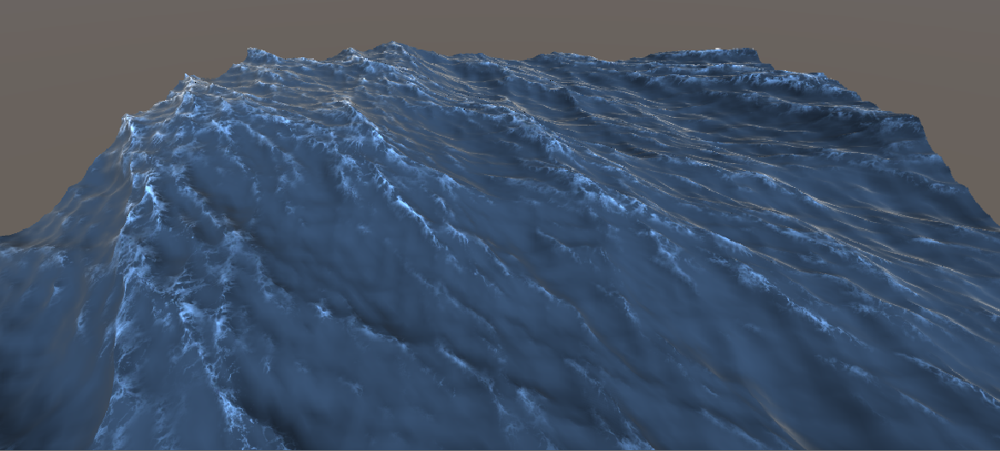

# Realistic Ocean Simulation Silvaa

**Figure 1:** Simulated water surface with a realistic surface shader in a grid of 256x256 and a total size of 100 meters. 

## Introduction
In this project, I will implement the well known statistical wave model from Tessendorf's paper[1] on simulating height fields for ocean waves.
This approach recreates a piece of the ocean surface from a Fast Fourier Transform (FFT) prescription, with user-controllable size and resolution, and which can be tiled seamlessly over a larger domain.
Each point contains a large sum of sine waves with different amplitudes and phases; however, these functions comes from using statistical-empirical models of the ocean, based on oceanographic research. 
In the first part of this article, I will be explaining how to model and animate the structure of ocean surface, while in the second one how to create illumination effects and foam. 

## Statistical Wave Model
Statistical models are based on the concept that ocean height h(**x**, t) is a random variable in each horizontal position **x** and time t.  They rely on the fact that we can decompose the height field h(**x**, t) into a sum of sines and cosines, the coefficients that multiply each of these functions are obtained through the Fourier transform, as well as the original height field can be obtained using the inverse transform. The computation uses Fast Fourier Transforms (ffts), which are a rapid method of evaluating the sum.
So, we can write the height field as a sum of time-dependent amplitudes, with complex values. $ y = \vec{a} $

$$
h(\pmb{x}, t) = \sum_{\pmb{k}} \tilde h(\pmb{x},t).exp(i\pmb{k.x})
$$
with **k** defined as:
$$
\pmb{k} = (k_x, k_z)
\\~\\
k_x = \frac{2\pi n}{L_x}
\\~\\
k_z = \frac{2\pi m}{L_z}
$$
where:
$$
-\frac{N}{2} \leq  n \leq \frac{N}{2}
\\~\\
-\frac{M}{2} \leq  m \leq \frac{M}{2}
$$
but, for most of our work, we deal with variables i and j in different domains:
$$
0 \leq i <N
\\
0 \leq j <M
$$
so, we can make the transformation:
$$
n = i - \frac{N}{2}
\\~\\
m = j - \frac{M}{2}
$$
The fft process generates the height field at discrete points:
$$
 \pmb{x} = (\frac{nL_x}{N}, \frac{mL_z}{M})
$$

# Useful stuff
$$
P_h(\pmb{k}) = A\frac{exp(-1/(kL)^2)}{k^4} |\hat{\pmb{k}}.\hat{\pmb{v}}|^2
$$
$$
exp(-(kl)²)
$$
$$
\omega(k) = \sqrt{gk}
$$
$$
\tilde h_o(\pmb{k}) = \frac{(\xi_r + i\xi_i)}{\sqrt{2}} \sqrt{P_h(\pmb{k})}
$$
$$
P_h(\pmb{k}) = \langle |\tilde h^*(\pmb{k},t)|^2 \rangle
$$
$$
\tilde h(\pmb{k},t) = \tilde h_o(\pmb{k})exp(i\omega(\pmb{k})t) + \tilde h_o^*(\pmb{-k})exp(i\omega(\pmb{k})t)
$$
$$
\pmb{D}(\pmb{x},t) = \sum_{\pmb{k}}-i\frac{\pmb{k}}{k}\tilde h(\pmb{k},t)exp(i\pmb{k.x})
$$
$$
\pmb{x_f} = \pmb{x} + \lambda\pmb{D}(\pmb{x},t)
$$
$$
J_{xx} = 1 + \lambda\frac{\partial{\pmb{D}_x(\pmb{x})}}{\partial{x}}
\\~\\
J_{zz} = 1 + \lambda\frac{\partial{\pmb{D}_z(\pmb{x})}}{\partial{z}}
\\~\\
 J_{xz} = J_{{zx}} = \lambda\frac{\partial{\pmb{D}_x(\pmb{x})}}{\partial{z}}
$$
$$
J(\pmb{x}) = J_{xx}J_{zz} - J_{xz}J_{zx}
\\
J < 0
$$
$$
\epsilon(\pmb{x},t) = \nabla h(\pmb{x},t)
$$
$$
\hat{n}_s(\pmb{x},t) = \frac{\hat{y} - \epsilon(\pmb{x},t)}{\sqrt{1+\epsilon^2(\pmb{x},t)}}
$$
$$
\hat{n}_r(\pmb{x},t) = \hat{n}_i - 2\hat{n}_s(\pmb{x},t)(\hat{n}_s(\pmb{x},t).\hat{n}_i)
$$
$$
sin(\theta_i) = |\hat{n}_i\times\hat{n}_s|
$$
$$
sin(\theta_t) = |\hat{n}_t\times\hat{n}_s|
$$
$$
n_t sin(\theta_t) = n_i sin(\theta_i) 
$$
$$
R+T=1
$$
$$
R(\hat{n}_i, \hat{n}_r) = \frac{1}{2}\{  \frac{sin^2(\theta_t+\theta_i) }{sin^2(\theta_t-\theta_i)} + \frac{tan^2(\theta_t+\theta_i) }{tan^2(\theta_t-\theta_i)} \}
$$
$$
R_o = (\frac{n_1-n_2}{n_1+n_2})^2
$$
$$
R(\theta) = R_o + (1-R_o)(1-cos(\theta))^5
$$

## References
